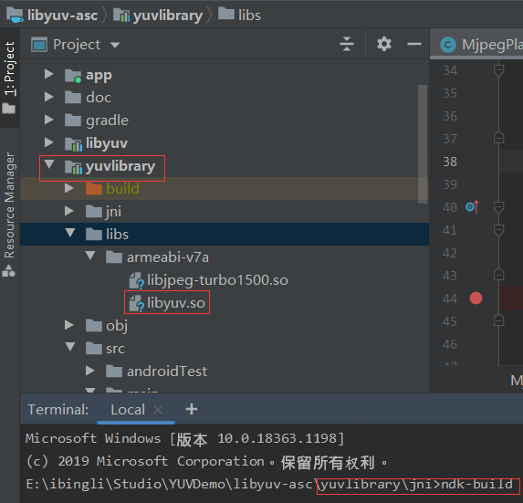
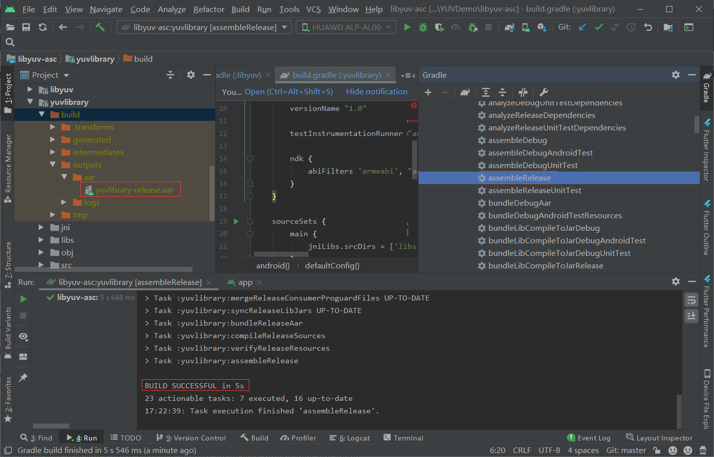
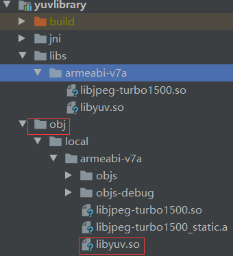
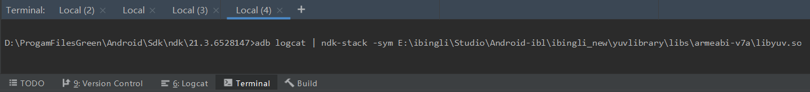
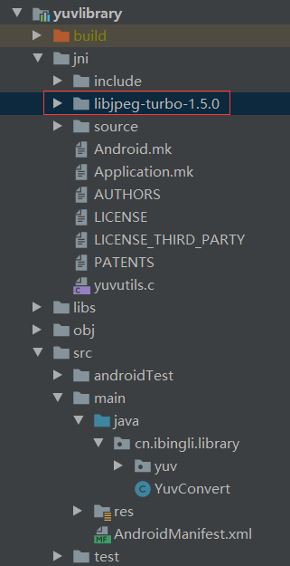
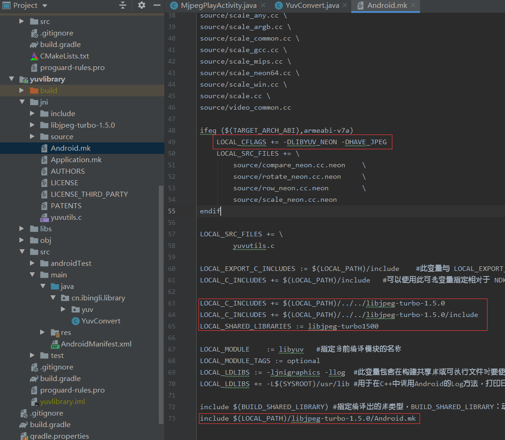
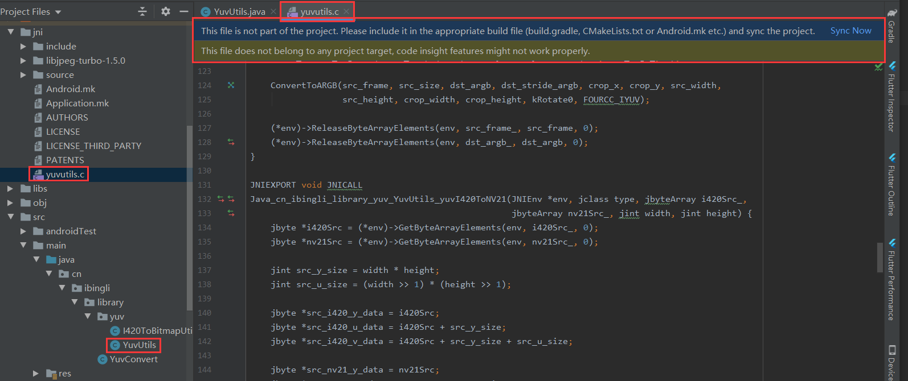
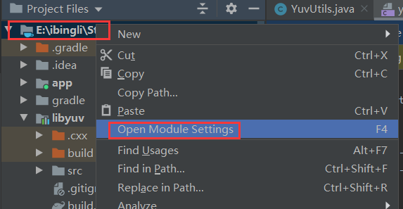
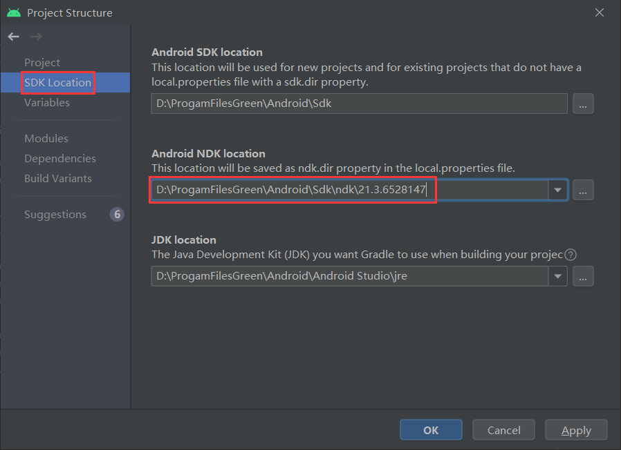

Tips：图片需要把文件拉到本地才能显示，用的是本地相对路径

# NDK配置

创建新项目之后，最开始调试的时候以library的方式导入项目，需要在build.gradle中配置ndk，以便导入library中libs目录下的so文件。

```xml
defaultConfig {
	......
    ndk {
        abiFilters 'armeabi', "armeabi-v7a"//, "x86", "mips"
    }
	......
}
```


# SO动态库编译

1. 先配置项目的NDK的路径，项目右键→open module settings→SDK Location→填入sdk的根目录
   
2. 在terminal中输入ndk-build执行打包脚本
   


# 打包aar

在Gradle窗口中找到assembleRelease命令执行打包流程。



将生成的aar包放入主项目的libs目录里面即可，这样便完成了ndk到主项目的引入。


# NDK中输出日志方法

Android-NDK中C++[打印日志到LogCat](http://www.linyibin.cn/2016/01/04/JNI-LogCat/)的步骤如下：

1. 在Android.mk上加上一行

   ```c
   LOCAL_LDLIBS :=  -L$(SYSROOT)/usr/lib -llog 用于在C++中调用Android的Log方法，打印日志到LogCat
   ```

2. 在Cpp实现文件中，导入头文件，并定义宏：

   ```c
   #include <android/log.h>
   #define LOG_TAG "JNI LOG"
   #define LOGE(a)  __android_log_write(ANDROID_LOG_ERROR,LOG_TAG,a)
   #define LOG(...) __android_log_print(ANDROID_LOG_ERROR,LOG_TAG, __VA_ARGS__)
   #define LOG_LINE LOG("%d", __LINE__)
   ```

3. 在代码中应用

   ```c
   LOGE("test");
   LOG("%d", 0);
   LOG_LINE;
   ```

另外一种方法，直接[引入一个log日志](https://blog.csdn.net/afei__/article/details/81429417)库的方法。[NDK 开发之 Android LOG 工具类](https://blog.csdn.net/afei__/article/details/81030373)。

这个例子简单易懂：[Android中Jni学习总结--Jni中打印log信息](https://www.jianshu.com/p/68a502953643)。


# 问题定位方法

[Android NDK Tombstone/Crash 分析](https://toutiao.io/posts/jflx6c/preview)；

## addr2line

具体使用方法查看这篇博文，写得很详细：[使用addr2line分析Crash日志](https://blog.csdn.net/Xiongjiayo/article/details/86514623)；

简单的使用步骤如下：

1. 先在terminal进入到addr2line工具的目录下：

   路径在"{NDK}/toolchains/{ABI}/prebuilt/windows-x86_64/bin/"下

   ```
     ${NDK}     // 你的NDK解压包路径
     ${ABI}     // 你的调试设备的CPU架构,通常来说实体机一般都是对应 arm-linux-androideabi
   ```

   cd D:\ProgamFilesGreen\Android\Sdk\ndk\21.3.6528147\toolchains\arm-linux-androideabi-4.9\prebuilt\windows-x86_64\bin

2. 然后提取指令的报错行数：arm-linux-androideabi-addr2line -C -f -e arm-linux-androideabi-addr2line -C -f -e E:\ibingli\Studio\YUVDemo\libyuv-asc\yuvlibrary\obj\local\armeabi-v7a\libyuv.so   0002fb62 0210f741
   这里SO的路径需要注意下，不是libs下面导入的路径，**而是生成SO时obj目录下的路径**，若为第三方so，则取libs的路径即可：
   


## ndk-stack

[ndk-stack调试命令使用](https://blog.csdn.net/nico0423/article/details/11537609?utm_medium=distribute.pc_feed_404.none-task-blog-BlogCommendFromMachineLearnPai2-4.nonecase&depth_1-utm_source=distribute.pc_feed_404.none-task-blog-BlogCommendFromMachineLearnPai2-4.nonecas)步骤：

1. 在工程目录下的jni文件夹下Application.mk中添加 APP_OPTIM := debug，然后重新编译so库

2. 在windows 下使用运行输入 cmd 进入 android-ndk 目录；或者直接在terminal命令输入框中进入ndk的根目录

   
   提取信息的命令：adb logcat | ndk-stack -sym E:\ibingli\Studio\Android-ibl\ibingli_new\yuvlibrary\obj\local\armeabi-v7a\libyuv.so

3. 运行命令 
   adb logcat | ndk-stack -sym d:\documents\project\inferno3\android\obj\local\armeabi\libgame_logic.so
   或者
   adb logcat | ndk-stack -sym d:\documents\project\inferno3\android\obj\local\armeabi
   查看所有的*.so调试信息 

4. 查看文件ndk-native 调试信息
   其中提取出来的[BuildId表示崩溃代码的版本](https://source.android.google.cn/devices/tech/debug/native-crash?hl=zh-cn#tombstones)。

   ```
   #00 0x0002fb62 /data/app/com.hyj.libyuv-62-Z5IyrZ-NFdYC0xxyc4Q==/lib/arm/libyuv.so (ABGRToUVRow_NEON+80) (BuildId: d3e714b3b840b2e9c740777882dc0b27ba6aa465)
   #01 0x000155a1 /data/app/com.hyj.libyuv-62-Z5IyrZ-NFdYC0xxyc4Q==/lib/arm/libyuv.so (ABGRToI420+284) (BuildId: d3e714b3b840b2e9c740777882dc0b27ba6aa465)
   #02 0x00031f43 /data/app/com.hyj.libyuv-62-Z5IyrZ-NFdYC0xxyc4Q==/lib/arm/libyuv.so (Java_cn_ibingli_library_yuv_YuvUtils_bitmap2i420WithC+242) (BuildId: d3e714b3b840b2e9c740777882dc0b27ba6aa465)
   ```

   

在模拟器上使用ndk-stack的方法：

1. 使用cmd 进入android-sdk的plafrom-tools目录
2. 运行 emulator -partition-size 512 -avd your_avd_name

## backtrace

当发生了so里面的崩溃之后，在logcat中查找“backtrace”关键字，可以看到so相应的报错信息，再结合addr2line、ndk-stack可以定位到错误具体行数。


# Libyuv资料

[android全平台编译libyuv库实现YUV和RGB的转换](https://blog.csdn.net/byhook/article/details/84475525?utm_medium=distribute.pc_aggpage_search_result.none-task-blog-2~all~first_rank_v2~rank_v28-6-84475525.nonecase&utm_term=libyuv%20rgb%E8%BD%ACi420&spm=1000.2123.3001.4430)；

[libyuv—libyuv测试使用ARGBToI420和ConvertToARGB接口](https://blog.csdn.net/XIAIBIANCHENG/article/details/73065646)；

[编译libyuv、迁移至Android studio的操作和遇到的问题](https://blog.csdn.net/silently_frog/article/details/98097888)；

[libyuv jpg图片转换为i420，旋转270度](https://www.jianshu.com/p/0d13851a383f)；

使用C的代码直接操作bitmap对象：[NDK 开发之 Bitmap 的使用](https://blog.csdn.net/afei__/article/details/81429417)；

[Android音视频——Libyuv使用实战](https://linqiarui.blog.csdn.net/article/details/101062704?utm_medium=distribute.pc_relevant.none-task-blog-BlogCommendFromMachineLearnPai2-4.control&depth_1-utm_source=distribute.pc_relevant.none-task-blog-BlogCommendFromMachineLearnPai2-4.control)；


## 转I420相关

mjpeg本身就是一种格式,网上有mjpeg直接转i420的库，使用libyuv::MJPGToI420转，将mjpeg转i420的格式，对应的C实现代码在convert_jpeg.cc这个类里面。

在使用libyuv的mjpeg转i420的时候，需要用到libjpeg的库，配置步骤如下：

1. 导入libjpeg-turbo-1.5.0库进项目
   

2. 在Android.mk中加入以下配置

   ```
   LOCAL_CFLAGS += -DLIBYUV_NEON -DHAVE_JPEG
   
   LOCAL_C_INCLUDES += $(LOCAL_PATH)/../../libjpeg-turbo-1.5.0
   LOCAL_C_INCLUDES += $(LOCAL_PATH)/../../libjpeg-turbo-1.5.0/include
   
   LOCAL_SHARED_LIBRARIES := libjpeg-turbo1500
   
   include $(PROJ_PATH)/libjpeg-turbo-1.5.0/Android.mk
   ```

   

3. 做好了这些配置之后，ndk就可以编译通过了。

## 查看.yuv文件

RawViewer.exe可以查看保存为.yuv文件的每一帧的数据效果。

cn.ibingli.library.yuv.I420ToBitmapUtils类里面有保存帧图片，帧数据流的方法，在调试、测试的时候使用的工具类。


# 问题集锦

在项目的开发测试过程中碰到的一些问题记录下来，以待日后查看。

## This file is not part of the project

当项目的ndk的路径没有设置的时候，就会在JNI的C实现方法上面报这个错误：



这个错误的原因是因为没有设置项目的NDK的路径，解决步骤如下：

1. 项目根目录上右键→open module settings
   
2. 在SDK Location中输入你对应的NDK的的路径即可
   
3. 最后点击Apply即可解决问题。