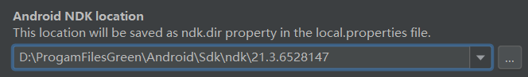

Tips：图片需要把文件拉到本地才能显示，用的是本地相对路径

# NDK配置

创建新项目之后，最开始调试的时候以library的方式导入项目，需要在build.gradle中配置ndk，以便导入library中libs目录下的so文件。

```xml
defaultConfig {
	......
    ndk {
        abiFilters 'armeabi', "armeabi-v7a"//, "x86", "mips"
    }
	......
}
```


# SO动态库编译

1. 先配置项目的NDK的路径，项目右键→open module settings→SDK Location→填入sdk的根目录
   
2. 在terminal中输入ndk-build执行打包脚本
   


# 打包aar

在Gradle窗口中找到assembleRelease命令执行打包流程。


将生成的aar包放入主项目的libs目录里面即可，这样便完成了ndk到主项目的引入。


# NDK中输出日志方法


- 问题定位方法
  - adder2line
  - ndk-slack


# 问题集锦

在项目的开发测试过程中碰到的一些问题记录下来，以待日后查看。

## This file is not part of the project

当项目的ndk的路径没有设置的时候，就会在JNI的C实现方法上面报这个错误：


这个错误的原因是因为没有设置项目的NDK的路径，解决步骤如下：

1. 项目根目录上右键→open module settings
   
2. 在SDK Location中输入你对应的NDK的的路径即可
   
3. 最后点击Apply即可解决问题。